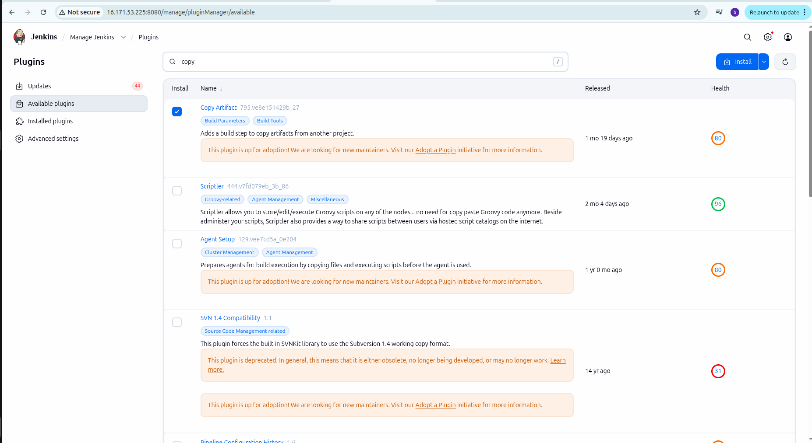
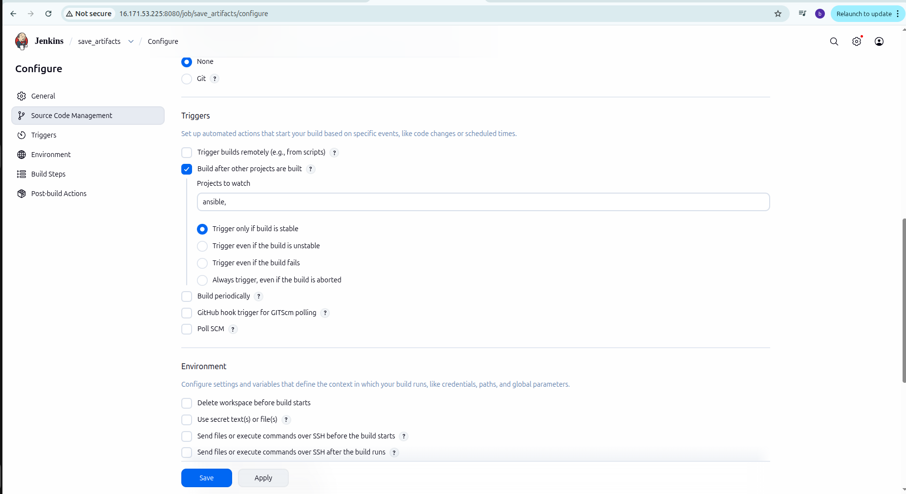
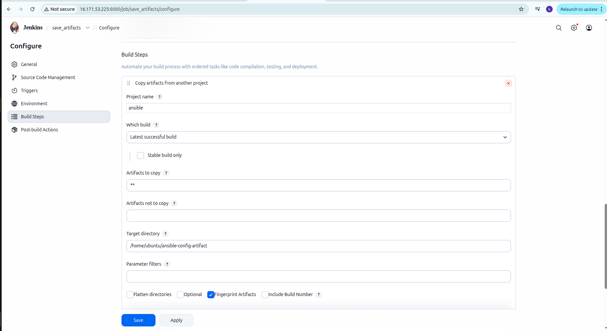
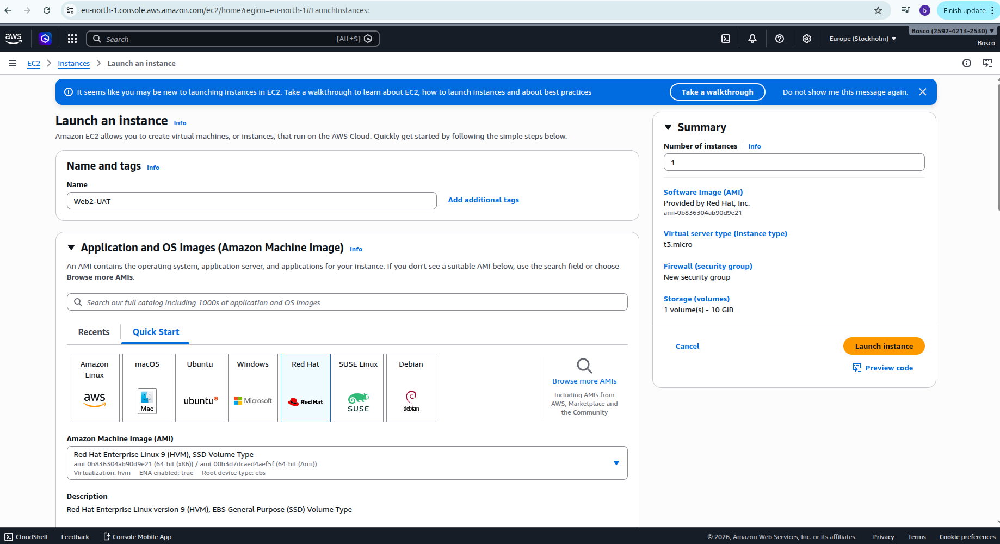
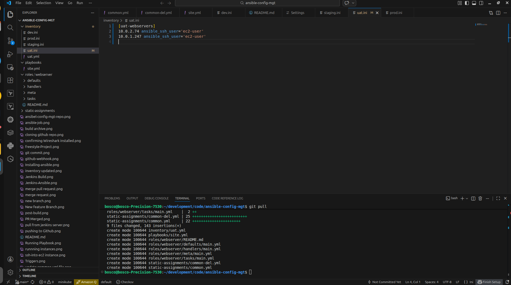
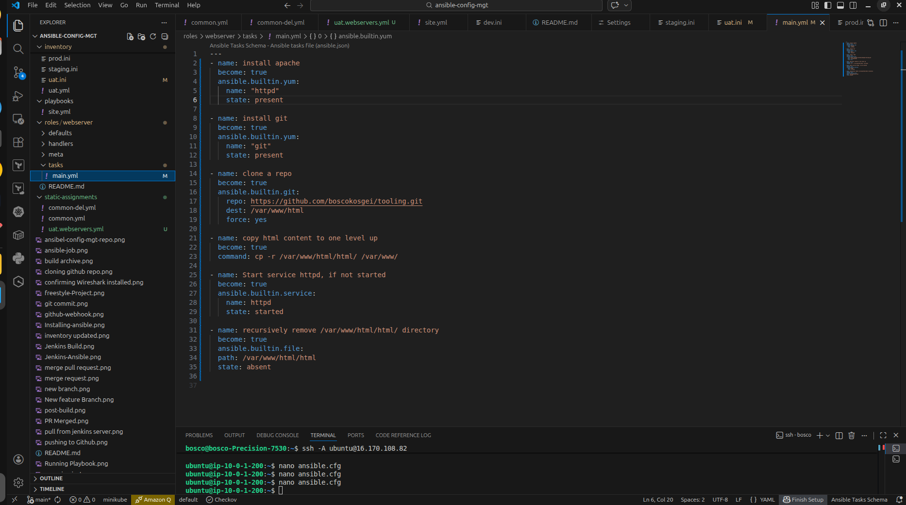
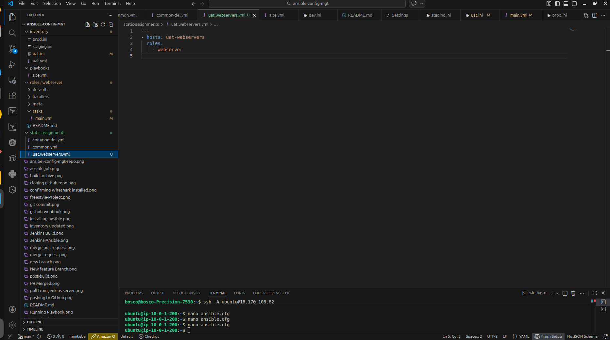
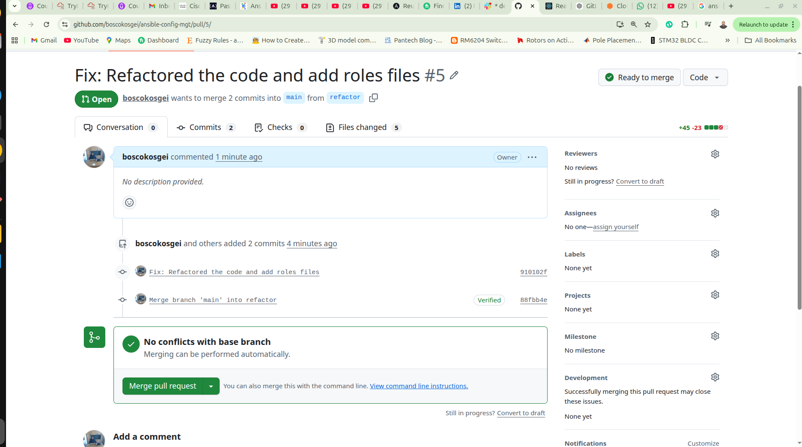

## Ansible Configuration Management
Integrating  Jenkins Pipeline With Github Webhook on Jenkins-Ansible EC2 Instance to install Wireshark on webservers,db, nfs server and lb server


## Prerequisites
- Linux
- AWS 
- Jenkins Server- To act as Bastion server
- Github- Create a Repository for the Project


## Step 1. Installing Ansible on Jenkins Server
Navigate to AWS Dashboard and start jenkins server, ssh into it using public ip and install ansible using command


ssh into jenkins-ansible server
```sh
   ssh -i "ubuntu_lb.pem" ubuntu@public ip
```


Install ansible
```sh
   sudo apt update
   sudo apt install ansible
```


## Step 2. Creating a Repo on Github account
Navigate to Github account and create a new repository called "ansible-config-mgt"


Creating Webhook on the Github Repo using Jenkins environment Url


Veryfying the Webhook has been configured


## Step 3. Configure Jenkins Job to Build 
Navigate to Jenkins on browser using the Public Ip and port and login to create a job


Create the job with Source code Management, Build ,Triggers and Post-Build to Archive 


## Step 4. Clonnning the Repository
Navigate to github and copy the url to the repo
ssh into the jenkins server to clone


Update Readme with content and push code


Confirmig the Build on Jenkins 


Checking the file is being archived in the path
```sh
  
```


## Create  a new Branch
On the Jenkins server inside the repo a new branch is created.


On the Local machine after cloning the repo a new branch is created to create the ansible files


## Setting up ssh Agent to connect Vscode with Jenkins-Ansible Instance
on the directory where the ssh key is mine is in the downloads folder
```sh
   cd \Downloads
   eval `ssh-agent`
```


Update the inventory files


Create and update Playbook folder


Pushing the code to Github
from the local machine the code is pushed to github on the feature branch to create a pull request


Create a Pull Request from Github Repo


Merging a Pull Request after checking everything is ok


## Create a Pull Request from the Jenkins Server on the main branch
ssh into  jenkins-Ansible server using the agent from Vscode
then create a pull in the cloned repo
```sh
    cd ansible-config-mgt
    git pull
```

## Running the Playbook
Ensure all the instance are up and running


Veryfying the wireshark has been installed


Project Completed Next is Ansible Refactoring...
Ansible is Very Interesting tool for DevOps..

## Jenkins Job Enhancement
Creating an ansible directory to store artifacts


Create a new project to save artifacts into the created directory after ansible job build


After installing plugin Create a job


Update configurations on job



Confirming after successful Build


## Refactoring Ansible Playbook by importing other playbooks
Starting on a new branch to create features
a new branch called refactor is created 


Importing common.yml file to playbook


Create a new Playbook common-del.yml to test after importing


Pushing the code to Github


Create a Pull request


Merging the branch to main after reviewing the code and resolving any conflicts


Runnning the Playbook


Veryfying the Playbook was successfully by checking wireshark if it has been deleted


## Creating New UAT webservers with a role webserver
Launch new EC2 Instance Running RHEL 9 Images on the two webserver.
Create 2 webserver Web1-UAT and Web2-UAT
 

Running the Instances


create roles folder


The roles structure folder


Updating the uat.yml files with the IP addresses of the new Server


Update task folder in webserver with main.yml


in the static folder creating a file to reference the roles


Pushing the Changes to Github


Create a Pull Request


Merging the code aftere review and resolving the conflicts


Runnning the Playbook


Checking for apache if its installed in one of uat servers


Updating Security Group on Port 80 for the website to be accessible


Accessing the website using public ip of Uat webserver1

